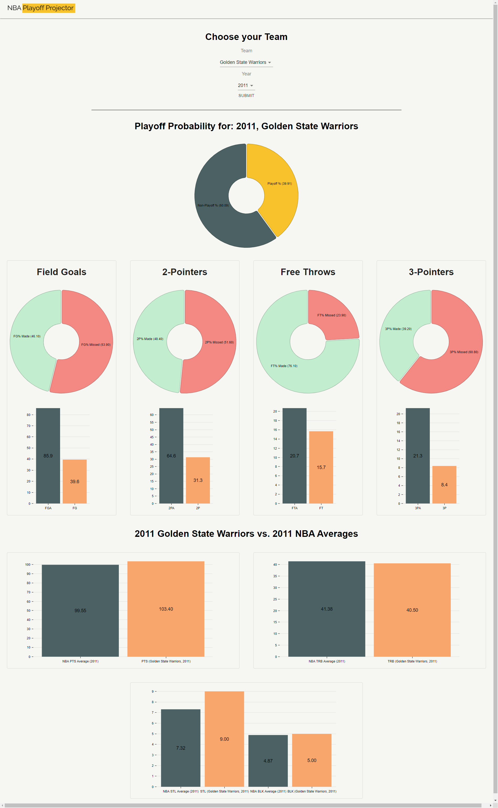
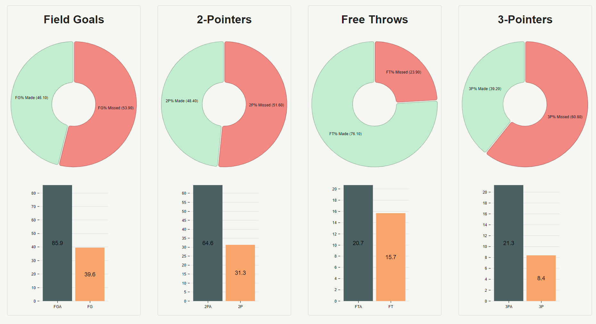
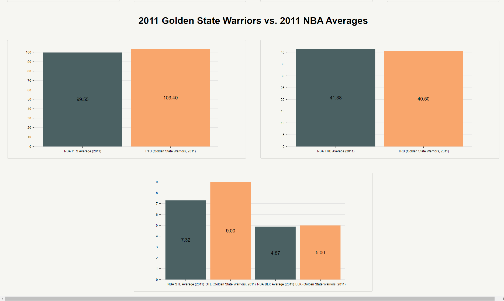

# NBA Playoff Projector
This web app aims to make stats interactive through visuals and uses machine learning to find the probability of a NBA team making the playoffs!

Web app available [here](jp-sdev.github.io/nba_clustering/)!

---

# Features
* Trained **Logistic Model** using the NBA team statistics from 1980-2019
  * more information on how the models were created [here](https://github.com/JP-sDEV/nba_playoff_modelling)!
* Graphing visuals for selected stats
* Determine the probability of historic teams making the playoffs

---

# Design Previews
## Desktop Preview
   

## Mobile Preview -- Coming soon!

---

# Development
## Requirements
* Python 3.8.5
* Node 10.19.0

## Setup
1. clone repo 
2. cd into server, and install requirements.txt - `pip install requirements.txt`
3. cd into client, and install packages - `npm install`
4. run the development environment - `npm run dev`

## Bug/Feature Requests
Feel free to submit issues [here](https://github.com/JP-sDEV/nba_clustering/issues) and/or submit a pull request [here](https://github.com/JP-sDEV/nba_clustering/pulls)

---

# Built With
*  [**React**](https://reactjs.org/) - Client side 
*  [**Flask**](https://flask.palletsprojects.com/en/1.1.x/) - Server side
*  [**Nivo**](https://nivo.rocks/) - Graphs/Visuals

---

# Acknowledgements
* The project was developed during CWF hosted by [helloMayuko](https://codewithfriends.io/events/cwf-fall-2020/)