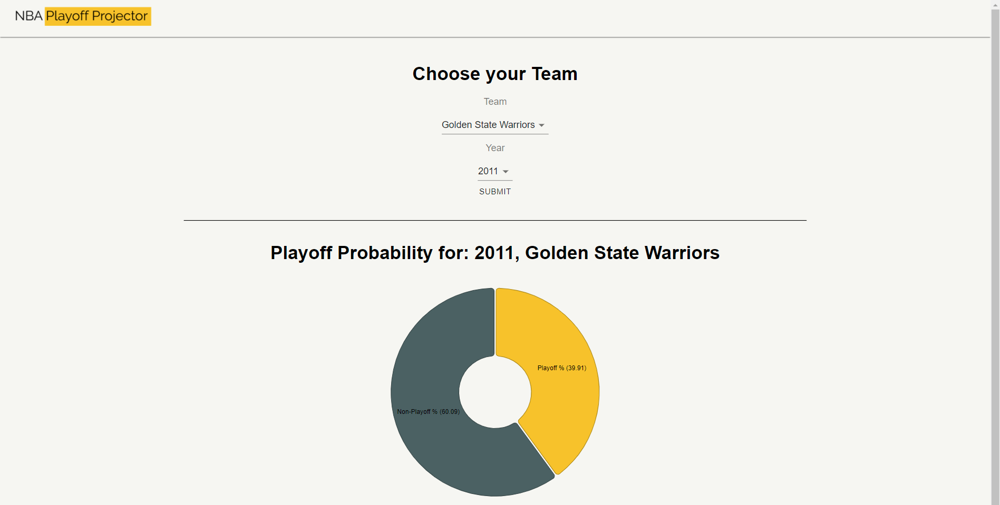

# NBA Playoff Projector

Use machine learning to find the probability of a NBA team making the playoffs!

  

## Features
* Trained **Logistic Model** using the NBA team statistics from 1980-2019
* Overview of team stats of historic NBA teams graphically
* Determine the probability of historic teams making the playoffs

   

## Requirements
* Python 3.8.5
* Node 10.19.0

## Tech
this project is using these technologies:

*  [**React**](https://reactjs.org/) - Client side 

*  [**Flask**](https://flask.palletsprojects.com/en/1.1.x/) - Server side

*  [**Nivo**](https://nivo.rocks/) - Graphs/Visuals